<div align="center">
  <a href="LICENSE"></a>
  <a href="https://nodejs.org/"></a>
  <a href="https://pnpm.io/"></a>
</div>

> [!NOTE]
> CQUT Auth 是为受控客户端提供登录服务的 OpenID Connect Provider。它通过重庆理工大学 UIS / CAS 验证学校账号，将验证结果关联到本地 Subject，再通过 Authorization Code + PKCE 向已审核的客户端签发令牌。
>
> 项目还提供客户端管理后台，可管理项目成员和 OIDC 客户端，配置 Redirect URI、Scope 与 Client Secret，并处理审核和运行策略。

> [!CAUTION]
> 本项目会在登录期间接收学校账号和密码，并将其用于请求 UIS；凭据不会写入数据库。部署者仍需自行完成安全评审、日志审计、网络隔离、密钥管理和隐私合规。请勿将未经审计的实例直接用于生产环境。

## 特别感谢

[「CQUT校园网登录脚本」](https://github.com/coldriver-chen/cqut-net-login)公开的重要信息，作为本项目的基座。本项目在其基础上进行了进一步的逆向分析与改进。

## 能力与边界

- OIDC Authorization Code 流程，强制 PKCE；支持 Web 和 SPA 客户端。
- `openid`、`profile`、`email`、`student`、`offline_access` Scope。
- UIS / CAS 登录、Service Ticket 校验和学校身份关联。
- 使用 PostgreSQL 保存 Subject、客户端、授权、签名密钥、管理会话和审计记录。
- 使用 Redis 限流；生产环境中限流服务不可用时会拒绝请求。
- Web 客户端 Secret 仅展示一次，以 scrypt 摘要保存，并支持宽限期轮换和指定撤销。
- 支持客户端 Revision 审核、项目成员权限管理和管理员紧急处置。
- 支持邮箱验证；邮件、时效、限流和配额策略可在管理后台调整。
- 支持 Refresh Token 轮换、客户端授权 Generation 和过期 Artifact 清理。

当前不支持动态客户端注册、Client Credentials、Device Flow、Introspection、标准 Revocation Endpoint 或 Implicit Flow。所有客户端均由管理后台或首次部署配置创建并审核。

`student` Scope 返回的 `status=active` 只表示学校账号已通过 UIS / CAS 验证且本地 Subject 可用，不代表当前在读或具有有效学籍。依赖学籍状态的业务不应使用该字段作出决定。

## 环境要求

- Node.js 24 或更高版本
- pnpm 10 或更高版本
- Docker Engine 与 Docker Compose v2
- 可访问 `uis.cqut.edu.cn`
- 生产环境需要可用的 HTTPS 域名和反向代理

## 本地启动

以下配置用于本地功能测试，不应作为生产配置：

```bash
pnpm install
pnpm init-env --profile test
pnpm docker:up
```

`init-env` 会生成：

- `deploy/.env`：包含随机数据库密码、加密密钥、Cookie 密钥和 CSRF 密钥；
- `deploy/oidc-clients.json`：包含一个演示客户端及其 scrypt Secret 摘要。

命令会在终端输出一次演示客户端明文 Secret。请立即保存；配置文件和数据库中均无法恢复该明文。

默认服务地址：

| 地址                                                     | 用途                               |
| -------------------------------------------------------- | ---------------------------------- |
| `http://127.0.0.1:3003/manage`                           | 客户端管理后台。                   |
| `http://127.0.0.1:3003/.well-known/openid-configuration` | OIDC Discovery。                   |
| `http://127.0.0.1:3003/health/live`                      | 进程存活检查。                     |
| `http://127.0.0.1:3003/health/ready`                     | PostgreSQL、Redis 和邮件状态检查。 |

邮箱验证默认启用。在管理员完成邮件通道配置前，`/health/ready` 会返回 `503 degraded` 和 `email: unconfigured`；这不妨碍打开管理后台完成首次配置。

停止服务：

```bash
pnpm docker:down
```

如果目标文件已存在，`init-env` 会拒绝覆盖。只有明确需要重新生成密钥和演示客户端时才使用 `--force`；覆盖后，旧数据中的密文和 Cookie 可能无法继续使用。

## 生产部署

### 1. 生成部署配置

```bash
pnpm install --frozen-lockfile
pnpm init-env --profile production --issuer https://auth.example.com
```

检查 `deploy/.env`，至少确认：

- `OIDC_ISSUER` 与外部 HTTPS 地址完全一致；
- `OIDC_COOKIE_SECURE=true`；
- `TRUST_PROXY_HOPS=1`；
- `TRUSTED_PROXY_CIDRS` 只包含实际反向代理来源；
- PostgreSQL 密码和各组安全密钥已妥善保存；
- `CQUT_UIS_BASE_URL`、`CQUT_CAS_APPLICATION_CODE` 和 `CQUT_CAS_SERVICE_URL` 符合当前 UIS 配置。

`init-env` 还会生成演示客户端。请在首次启动前检查 `deploy/oidc-clients.json` 的 Redirect URI 和 Scope；不需要引导客户端时，可以将 `clients` 改为空数组。

在生产模式下，缺少 PostgreSQL 或 Redis、关闭邮箱验证或 Artifact 清理、未启用限流的 fail-closed 策略、使用内存存储，或代理配置不完整，都会导致应用拒绝启动。

### 2. 初始化签名密钥并启动

全新数据库必须先创建一把 OIDC 签名密钥。容器镜像不包含开发期的 `tsx` 和源码，因此首次容器部署可临时设置：

```dotenv
OIDC_AUTO_SEED_SIGNING_KEY=true
```

启动生产服务：

```bash
docker compose -f deploy/docker-compose.prod.yml up -d --build
```

主仓库的 `master` 分支和 `v*` 版本标签会通过 GitHub Actions 自动构建
`linux/amd64`、`linux/arm64` 镜像并发布到 GitHub Container Registry：

```bash
docker pull ghcr.io/cqut-openproject/cqut-auth:latest
```

`master` 会生成 `latest`、`master` 和 `sha-<commit>` 标签；例如 `v1.2.3`
版本标签还会生成 `v1.2.3`、`1.2.3`、`1.2` 和 `1`。如果镜像包未设置为公开，
拉取前需要先使用具有 `read:packages` 权限的 GitHub Token 登录 `ghcr.io`。

确认 `/health/live` 和 Discovery 正常后，将 `OIDC_AUTO_SEED_SIGNING_KEY` 改回 `false` 并重启。后续签名密钥由数据库管理，不需要每次启动重新生成。此时 `/health/ready` 仍可能因为邮件尚未配置而返回 `503`。

### 3. 配置反向代理

生产 Compose 默认只把应用绑定到宿主机 `127.0.0.1:3003`。反向代理应：

- 对外提供 HTTPS；
- 将 Host 和协议转发给应用；
- 覆盖而不是透传客户端提供的 `X-Forwarded-For`；
- 使应用看到的直连来源位于 `TRUSTED_PROXY_CIDRS`；
- 不直接暴露 PostgreSQL 和 Redis。

更换域名后不能只修改代理配置；必须同步更新 `OIDC_ISSUER`，并重新检查所有客户端 Redirect URI。

### 4. 建立管理员

1. 打开 `/manage`，使用学校账号登录；
2. 在管理后台复制当前 Subject ID；
3. 将该值加入 `OIDC_ADMIN_SUBJECT_IDS`，多个值用逗号分隔；
4. 重启服务并重新登录。

管理员可以审核客户端 Revision、管理全局运行策略、配置邮件通道并执行紧急处置。运行策略写入 PostgreSQL 后，需要重启服务才会生效。

完成邮件通道配置和测试后，确认 `/health/ready` 返回 `200 ready`，再将实例加入反向代理或负载均衡器的生产流量。

## OIDC 接入

### 端点

| 端点                                    | 用途                     |
| --------------------------------------- | ------------------------ |
| `GET /.well-known/openid-configuration` | Discovery。              |
| `GET /auth`                             | Authorization Endpoint。 |
| `POST /token`                           | Token Endpoint。         |
| `GET /userinfo`                         | UserInfo Endpoint。      |
| `GET /jwks`                             | 签名公钥。               |
| `GET /session/end`                      | RP-Initiated Logout。    |

### Scope 与 Claim

| Scope            | Claim / 行为                                                     |
| ---------------- | ---------------------------------------------------------------- |
| `openid`         | `sub`。所有客户端 Revision 必须包含。                            |
| `profile`        | `preferred_username`、`name`。当前 `name` 为系统生成的占位名称。 |
| `email`          | 仅在邮箱已验证时返回 `email` 和 `email_verified=true`。          |
| `student`        | 返回 `status`；该字段不代表当前学籍。                            |
| `offline_access` | 在客户端允许 Refresh Token 时请求离线访问。                      |

Web 客户端使用 `client_secret_basic`。SPA 是公开客户端，不生成 Client Secret；默认不向公开客户端签发 Refresh Token。所有客户端均使用 Authorization Code + PKCE `S256`，Redirect URI 必须与已审核配置精确匹配。

### 客户端生命周期

客户端由项目成员在 `/manage` 创建：

1. 创建项目并维护 owner、maintainer、viewer 成员；
2. 创建 Web 或 SPA 客户端；
3. 编辑 Redirect URI、Logout URI 和 Scope；
4. 提交 Revision；
5. 等待管理员批准后进入可用状态。

修改已启用客户端的安全相关配置时，系统会生成新的 Revision；审核期间，客户端继续使用上一份已批准的配置。Web Client Secret 只在创建或轮换响应中显示一次，数据库仅保存 scrypt 摘要。停用客户端或撤销授权后，对应的 Artifact 会立即失效。

<details>
<summary>UIS / CAS 认证实现与字段简易分析</summary>

登录流程由服务端完成，不依赖浏览器保存学校会话：

1. 请求 UIS CAS 登录地址，解析实际 `service`；
2. 使用 UIS 登录页的 RSA 规则加密密码，提交 `/center-auth-server/sso/doLogin`；
3. 再次请求 CAS 登录地址并停止在 `302`；
4. 从 `Location` 提取一次性 `ST-*` Service Ticket；
5. 使用签发 Ticket 时完全相同的 `service` 调用 `/center-auth-server/cas/serviceValidate`；
6. 使用带命名空间的 XML 解析器验证 `authenticationSuccess`，拒绝 DOCTYPE、超限响应、重复结果和冲突标识；
7. 比较 `user`、`uid`、`user_code` 与登录账号，确认身份一致后建立本地 Subject。

UIS 实测还会返回 `user_name`、`user_user_type`、`universityId` 和 `authServerToken`。本系统只使用用户标识，不保存任何真实姓名、数字用户类型或内部令牌。单一学生样本中 `user_user_type=3` 与办事大厅的 `STUDENT` 类型对应，但该结果不足以证明完整类型映射。

`serviceValidate?format=JSON` 实测只改变响应头，响应体仍为 XML；接入实现不能依赖该参数进行 JSON 解析。

</details>

## 配置说明

`deploy/.env.example` 是部署期配置模板。以下变量决定应用能否安全启动：

| 变量                              | 说明                                                       |
| --------------------------------- | ---------------------------------------------------------- |
| `APP_ENV`                         | `production`、`development` 或 `test`。                    |
| `OIDC_ISSUER`                     | 对外 Issuer；非测试环境必须使用 HTTPS。                    |
| `DATABASE_URL`                    | 应用使用的 PostgreSQL URL，由 Compose 根据数据库变量组装。 |
| `REDIS_URL`                       | Redis URL；生产环境必需。                                  |
| `OIDC_KEY_ENCRYPTION_SECRET`      | 数据库签名私钥加密密钥。                                   |
| `OIDC_ARTIFACT_ENCRYPTION_SECRET` | OIDC Artifact 载荷加密密钥，必须与前者不同。               |
| `OIDC_COOKIE_KEYS`                | Cookie 签名密钥列表，可按顺序轮换。                        |
| `OIDC_CSRF_SIGNING_SECRET`        | CSRF Token 签名密钥。                                      |
| `TRUST_PROXY_HOPS`                | 生产环境固定为一层可信代理。                               |
| `TRUSTED_PROXY_CIDRS`             | 允许提供转发 IP 的代理来源 CIDR。                          |
| `OIDC_ADMIN_SUBJECT_IDS`          | 管理员 Subject ID 白名单。                                 |
| `OIDC_AUTO_SEED_SIGNING_KEY`      | 是否在无签名密钥时自动初始化，生产常态应为 `false`。       |
| `CQUT_UIS_BASE_URL`               | UIS 基础地址。                                             |
| `CQUT_CAS_APPLICATION_CODE`       | CAS 应用代码。                                             |
| `CQUT_CAS_SERVICE_URL`            | CAS Ticket 绑定的 Service URL。                            |

邮件发送参数、Token 和会话时效、验证码策略、业务限流及项目配额都在管理后台的“系统设置”中维护。启动时会忽略对应的旧环境变量，不应再用它们配置这些项目。

`deploy/oidc-clients.json` 只在客户端表为空时执行一次引导导入。数据库已有客户端后，修改该文件不会更新现有记录。

## 开发

常用命令：

```bash
pnpm dev            # 监听服务端和管理后台构建
pnpm test           # 运行服务端与前端测试
pnpm test:server    # 仅运行 Node.js / tsx 测试
pnpm test:ui        # 仅运行 Vitest 前端测试
pnpm lint           # 检查环境变量来源和 TypeScript 类型
pnpm build          # 构建服务端与管理后台到 dist/
pnpm format         # 使用 Prettier 格式化仓库
```

指定服务端测试：

```bash
pnpm exec tsx --test test/crypto.test.ts
```

`pnpm dev` 从 `deploy/.env` 读取配置。需要 PostgreSQL 和 Redis 时，可直接使用开发 Compose；容器会挂载当前工作区并运行监听构建。

提交前至少运行：

```bash
pnpm lint
pnpm test
pnpm build
```

## 安全说明

- 不记录账号密码、CAS Ticket、门户 Ticket 或 `authServerToken`。
- 生产环境必须启用 HTTPS 和安全 Cookie，校验可信代理，并在 Redis 限流服务不可用时拒绝请求。
- 各组加密密钥、Cookie 密钥和 CSRF 密钥必须独立生成并妥善备份。
- 不要把 `deploy/.env`、明文 Client Secret 或私钥提交到仓库。
- 管理 API 使用独立 HttpOnly 会话和 CSRF Token；反向代理不应缓存相关响应。
- Client Secret 明文只出现一次；轮换前应确认使用方已经准备切换。
- 定期备份 PostgreSQL，并验证签名密钥和加密密钥能够恢复。

## 许可证

本项目基于 [MIT](./LICENSE) 协议开源。
