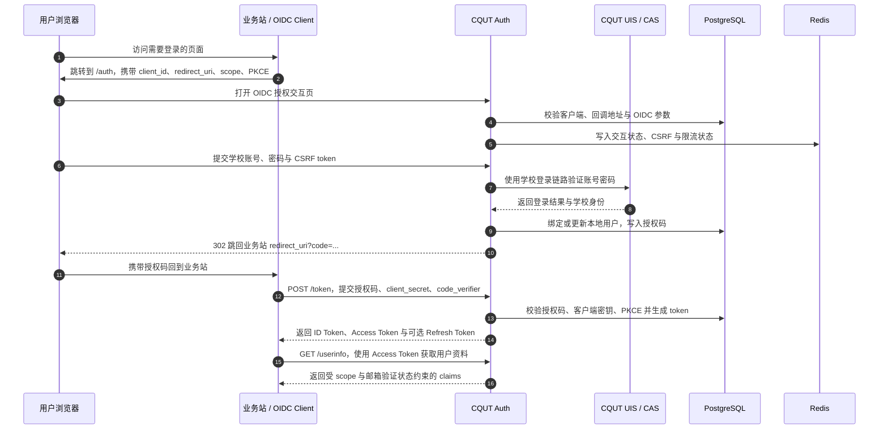

> [!NOTE]
> 本项目大部分代码、测试和文档均由智能体编写。维护者仅对体感功能进行简单测试，对数据安全与代码质量不作任何保障，但我们会尽最大努力修复问题。

<div align="center">
  <a href="LICENSE"></a>
  <a href="https://nodejs.org/"></a>
  <a href="https://pnpm.io/"></a>
</div>

## ✨ 特性 (Features)

- **🏫 无缝对接校园认证**：将学校 UIS / CAS 登录链路安全包装为标准 OIDC 登录入口。
- **🔐 标准协议支持**：完整支持 Authorization Code + PKCE 流程，签发高可靠 ID / Access Token。
- **🎛️ 受控客户端管理**：客户端由 PostgreSQL 持久化，通过登录保护的管理台创建、审核、编辑和停用。
- **🔐 凭据生命周期**：Web Client Secret 支持双 Secret 宽限轮换、指定撤销与客户端级紧急撤权。
- **🛡️ 生产级安全防护**：内置交互页 CSRF 校验、端点及登录限流、Refresh Token Rotation、Artifact 自动清理。
- **📧 邮箱验证引擎**：原生内置 Resend 邮件服务支持，保障用户的实名绑定链路。
- **📦 现代化技术栈**：搭配 PostgreSQL 持久化与 Redis 高缓存，基于 Node.js 24 无缝构建。

## 🏗️ 原理与架构 (Architecture)

CQUT Auth 不存储学校的账号密码，亦不强行替代业务站的原始用户系统。它在 OIDC 协议和学校登录链路间建立了一座信任代理桥梁：业务站发起标准登录请求，随后用户在受控沙箱向学校系统进行身份验证；验证通过后，服务将对应凭据映射为本地 Subject，向业务终端下放 Token。

整个流程由四个逻辑核心层组成：

1. **入口层**：外部 HTTPS 代理（如 Nginx）处理 TLS 连接与业务卸载。
2. **协议层**：实现核心的 OIDC 通信逻辑端点 (`/auth`, `/token`, `/userinfo`, `/jwks`, `/session/end`)。
3. **身份层**：负责下发鉴权表单，转接 CQUT UIS / CAS 的交互，并完成邮件、会话等上下文映射。
4. **存储层**：利用 PostgreSQL 沉淀稳定数据，依赖 Redis 提供高频瞬态防护能力（限流与会话隔离）。



## 🚀 快速开始 (Getting Started)

### 前置依赖 (Prerequisites)

- [Node.js](https://nodejs.org/) v24+
- [pnpm](https://pnpm.io/) v10+
- [Docker](https://www.docker.com/) 20.10+ & [Compose](https://docs.docker.com/compose/) v2+

### 一键启动

1. **获取代码并安装依赖**

   ```bash
   pnpm install
   ```

2. **本地测试环境 (HTTP)**

   ```bash
   # 初始化测试环境，自动配置内置 demo 客户端
   pnpm init-env --force --profile test

   # 启动后端中间件集群
   docker compose -f deploy/docker-compose.yml up -d --build

   # 等待启动并检测健康状态
   curl http://127.0.0.1:3003/health/ready
   curl http://127.0.0.1:3003/.well-known/openid-configuration
   ```

   _注意：使用 `--force` 将抹除先前的加密轮数并覆写预置信息。如若数据库中保留了早期密码可能会发生鉴权拒绝，推荐执行 `docker compose -f deploy/docker-compose.yml down -v` 彻底洗卷。_

3. **本地开发联调网络 (HTTPS)**
   适用于由宿主机或网关代理终止 TLS 的场景：

   ```bash
   pnpm init-env --force --profile local --issuer https://verify.local
   docker compose -f deploy/docker-compose.yml up -d --build
   ```

## 🛠️ 部署指南 (Deployment)

推荐的拓扑是由您自己控制的反向代理暴露对外 HTTPS 入口，通过 Compose 打包发布服务集群。

```bash
# 生成供正式使用的 env 安全模板
pnpm init-env --force --profile production --issuer https://auth.example.com

# 以后台常驻唤起
docker compose -f deploy/docker-compose.prod.yml up -d --build
```

**🚨 生产上线前检查清单：**

- [ ] `OIDC_ISSUER` 必须与外场可达的 HTTPS 域名完全对齐。
- [ ] `OIDC_COOKIE_SECURE=true`、`TRUST_PROXY_HOPS=1` 与 `TRUSTED_PROXY_CIDRS` 配置完毕，反向代理必须覆盖 `X-Forwarded-For`。
- [ ] 项目中涉及的各套秘钥组（Cookie / 加密 / Redis 等）均已更改为高熵值。
- [ ] 已在管理台「系统设置」中配置并测试邮件通道，随后重启服务使配置生效。
- [ ] 如需预置客户端，已写入 `deploy/oidc-clients.json`；缺失或空文件允许从零客户端启动。
- [ ] 至少一名管理员的 Subject ID 已写入 `OIDC_ADMIN_SUBJECT_IDS`。
- [ ] 初次启动可通过设定 `OIDC_AUTO_SEED_SIGNING_KEY=true` （或命令执行）完成签名私钥分发。
- [ ] 确保 `APP_ENV=production` 环境下正确连接到了非易失形态的 PostgreSQL 与 Redis 实例。

## 🔌 接入文档 (Integration)

### 基本安全要求

- 当前环境下拒绝 Implicit 以及部分混合模式，强校验 **Authorization Code + PKCE (`S256`)** 协议流。
- 正式环境下回调及回溯域必须通过 `https://` 约束，严防劫持。

### 客户端初始化与管理

数据库是客户端配置的唯一运行时数据源。`oidc-clients.json` 只在 `oidc_clients` 表为空时进行一次性、事务化导入；导入的 Bootstrap Client 固定属于 `system` 项目，该项目不接受成员且仅管理员可见和管理。

打开 `/manage`，使用校园统一身份认证账号登录即可创建项目；创建者自动成为 owner，并可通过已经存在的 Subject ID 添加成员。第一版不提供邮件邀请。

1. 普通登录 `/manage`，在页面顶部复制自己的 `Subject ID`；
2. 将该值加入 `OIDC_ADMIN_SUBJECT_IDS`（多个值以逗号分隔）；
3. 重启服务，再次登录后即可看到全局项目和“待审核”。

项目使用 `projects` 和 `project_members` 保存，角色为 `owner`、`maintainer`、`viewer`。客户端通过非空 `project_id` 归属项目，`created_by_subject_id` 仅用于审计。项目元数据与成员变更共享 `projects.version` 乐观锁；Repository 在同一事务内锁定项目、校验版本及 owner 数量，因此并发请求也不能删除或降级最后一名 owner。添加成员时会在项目事务内锁定并复核 Subject 仍为 active。

所有客户端写操作都会在实际写事务中再次读取项目状态和当前成员角色，并统一按“先锁项目、再锁客户端”的顺序线性化鉴权。成员删除或项目归档一旦先提交，已经完成 Service 前置检查但尚未获得事务锁的客户端创建、修改、Revision、Secret 或撤销请求也会失败且不写审计；成员关系不缓存到管理会话。

| 操作                           | owner | maintainer | viewer |        管理员        |
| :----------------------------- | :---: | :--------: | :----: | :------------------: |
| 查看项目、成员、客户端和审计   |   ✓   |     ✓      |   ✓    |         全局         |
| 修改项目、管理成员、转移所有权 |   ✓   |            |        |      作为成员时      |
| 创建/修改客户端及提交 Revision |   ✓   |     ✓      |        | 系统项目或作为成员时 |
| 轮换 Secret、撤销授权          |   ✓   |     ✓      |        |       紧急处置       |
| 撤销指定 Secret、紧急停用      |   ✓   |            |        |         全局         |
| 批准/拒绝 Revision             |       |            |        |          ✓           |

非成员访问项目及其客户端、Revision、Secret、撤销或审计资源统一得到 `404`；已能查看项目但角色不足时得到 `403`。归档项目只读且不影响现有 OIDC 客户端运行，仅管理员可继续审核或紧急处置。

API 或管理台创建的客户端先进入客户端草稿，并生成 Draft Revision；所有者确认后显式提交审核。Web 客户端的 `client_id` 与高熵 `client_secret` 由服务端生成，Secret 仅在创建响应中显示一次；SPA 是公开客户端，不生成 Secret。客户端类型创建后不可修改，Web/SPA 类型变更必须新建客户端。

Web Client Secret 独立保存在 `oidc_client_secrets`，只有 `active` 和尚未到期的 `retiring` Secret 可用于客户端认证。轮换时新 Secret 仅显示一次；旧 Secret 默认保留 24 小时宽限期，可在 0–7 天内配置。一个客户端同时最多有两个可用 Secret，已撤销或过期 Secret 不可恢复。部署期 `oidc-clients.json` 仍可提供受信任的 scrypt bootstrap digest，但管理 API 不接受明文或摘要输入。

Secret 轮换在 scrypt 计算前执行版本与数量预检，并同时按主体、客户端和来源 IP 限流；PostgreSQL 使用 `now()` 计算创建时间、宽限期和冷却时间。OIDC 认证只查询 active 或尚未到期的 retiring 摘要。管理台按页展示 Secret 历史，数据库仅保留最近 100 条已撤销或已到期的历史元数据，完整操作轨迹仍保留在不含摘要的审计日志中。

每个客户端具有单调递增的授权 Generation。Authorization Code、Access Token、Refresh Token 和 Grant 保存签发请求捕获的 Generation；客户端级撤销或紧急停用会在删除现有 Artifact 的同一事务中递增 Generation。Artifact 每次读取都会核对客户端状态和 Generation，因此撤销提交后才落库的并发 Token 也不可使用，已停用客户端的 Artifact 始终无效。

客户端生命周期（`draft`、`active`、`disabled`）与 Revision 审核状态（`draft`、`pending`、`approved`、`rejected`、`cancelled`）相互独立。Active 客户端修改 Redirect URI、Logout URI 或 Scope 时会创建 Pending Revision，审核期间 OIDC 仍读取旧的 Active Revision；批准后原子切换，拒绝不会影响线上配置。Pending Revision 必须先撤回才能编辑，拒绝原因必填且会展示给所有者。停用立即生效且不能恢复，并会原子取消开放的 Draft/Pending Revision、释放待审配额。

每个 Subject 默认最多创建 5 个 active 项目，项目创建同时按 Subject（默认每小时 3 次）和来源 IP（默认每小时 10 次）限流，并使用 Subject Advisory Lock 防止并发绕过。普通项目默认最多拥有 10 个非停用客户端和 5 个 Pending Revision；同一项目创建者名下的所有项目还共享 30 个非停用客户端和 15 个 Pending Revision 的第二层上限。客户端创建继续按操作主体（默认每小时 5 次）和来源 IP（默认每小时 20 次）限流。管理员豁免分别由显式配置控制。

邮件、OIDC/验证码时效、业务限流以及项目与客户端配额统一在管理台「系统设置」中维护。设置以加密形式保存到数据库并记录审计日志；保存不会热更新当前进程，重启服务后生效。首次部署未配置邮件通道时服务会以 degraded 状态启动，便于管理员进入面板完成初始化。

<details>
<summary><code>oidc-clients.json</code> 范例</summary>

```json
{
  "clients": [
    {
      "clientId": "demo-site",
      "displayName": "Demo Site",
      "description": "首次部署演示客户端",
      "clientSecretDigest": "scrypt$N=16384,r=8,p=1,keylen=32$<base64url-salt>$<base64url-digest>",
      "grantTypes": ["authorization_code", "refresh_token"],
      "scopeWhitelist": ["openid", "profile", "email", "student"],
      "redirectUris": ["https://demo.example.com/callback"],
      "postLogoutRedirectUris": ["https://demo.example.com/logout-complete"],
      "autoConsent": false
    }
  ]
}
```

    </details>

`offline_access` 是 Web 客户端的显式 opt-in scope，不在默认 `scopeWhitelist` 内。SPA 固定使用 Authorization Code + PKCE，不允许 refresh token 或 `offline_access`。所有 Revision 必须包含 `openid`。Native、M2M 和包含通配符或 fragment 的 Redirect URI 均不接受。

`student` scope 只增加 `status` claim。当前 `status=active` 表示该账号已通过学校 UIS/CAS 认证且可在本 OP 中使用，不代表“当前在读学生”身份；RP 不应据此推断学籍状态。

### OIDC 核心端点映射表

| 功能区        | 端点 URI                                | 操作详述                                                                                |
| :------------ | :-------------------------------------- | :-------------------------------------------------------------------------------------- |
| **Discovery** | `GET /.well-known/openid-configuration` | 获取服务支持的签名算法与节点映射表。                                                    |
| **Authorize** | `GET /auth`                             | 重定向登入，允许附带客户端白名单内的 `openid profile email student offline_access` 域。 |
| **Token**     | `POST /token`                           | basic auth/form 模式签发/转结令牌；Public Client 默认不签发 Refresh Token。             |
| **UserInfo**  | `GET /userinfo`                         | 校验 Access 以查询 User 字段。注意 `邮箱` 相关数据仅过审可返回。                        |
| **Logout**    | `GET /session/end`                      | 注销全域登录状态（应附 `id_token_hint`及回溯）。                                        |
| **JWKS**      | `GET /jwks`                             | 提供用于客户端对端强验证的 RSA-256 (RS256) 公钥串。                                     |

### 客户端管理 API

管理 API 全部位于 `/api/management`，使用独立的 HttpOnly 数据库会话；所有修改请求还必须携带管理上下文返回的 `X-CSRF-Token`。

| 路由                                                                                       | 说明                                                |
| :----------------------------------------------------------------------------------------- | :-------------------------------------------------- |
| `GET /auth/context`                                                                        | 获取登录状态、Subject ID、管理员标记和 CSRF token。 |
| `POST /auth/login` / `POST /auth/logout`                                                   | 建立或撤销管理会话。                                |
| `GET/POST /projects`                                                                       | 列出可见项目或创建项目并成为 owner。                |
| `GET/PATCH /projects/:projectId`                                                           | 查看、修改或按项目版本归档项目。                    |
| `GET/POST /projects/:projectId/members`                                                    | 查看成员或通过已有 Subject ID 添加成员。            |
| `PATCH/DELETE /projects/:projectId/members/:subjectId`                                     | 按项目版本变更角色或删除成员。                      |
| `POST /projects/:projectId/ownership/transfer`                                             | 原子转移 owner，并将来源 owner 降为 maintainer。    |
| `GET /projects/:projectId/audit-logs`                                                      | 分页读取项目及其客户端审计。                        |
| `/projects/:projectId/clients[/:clientId]`                                                 | 项目内客户端列表、创建、查看和元数据修改。          |
| `.../revision`、`.../revision/submit`、`.../revision/withdraw`                             | 保存、提交或撤回 Revision。                         |
| `.../secrets/rotate` / `.../secrets/:secretId/revoke`                                      | 轮换或撤销 Secret。                                 |
| `.../authorizations/revoke` / `.../disable`                                                | 撤销授权或紧急停用客户端。                          |
| `GET /admin/reviews`                                                                       | 管理员获取全局 Pending Revision。                   |
| `POST /admin/projects/:projectId/clients/:clientId/revisions/:revisionId/{approve,reject}` | 管理员批准或拒绝 Revision。                         |

客户端响应只返回 Secret 标识、状态和时间，不返回摘要。创建 Web 客户端时的 `clientSecret` 及轮换响应中的 `secret.value` 只存在于各自的单次 `201` 响应，不可再次查询。`project_audit_logs` 只记录字段名、角色/状态变化和资源标识，不保存 Secret、摘要或配置值；所有修改仍要求管理 CSRF token 和相应乐观锁版本。

## 🧑‍💻 常用指令 (Scripts)

```bash
# 进入调试/开发状态
pnpm dev
# 执行核心套件检查
pnpm test
pnpm lint
pnpm build

# 服务数据辅助操作
pnpm seed:key      # 为 OIDC 补种 RSA 签名池
pnpm seed:client   # 仅在客户端表为空时导入 JSON；不会覆盖已有记录
```

第四轮改造验收结果：`pnpm lint`、`pnpm build` 均通过；配置真实 PostgreSQL 后，服务端测试 `170/170`、管理 UI 测试 `8/8` 通过，数据库并发套件中的 17 项子测试全部执行且无跳过。

## 🛡️ 能力边界 (Limitations)

本项目主诉为**微型内聚的单一 Provider**，不考虑全量 OIDC 范式覆盖。

**已内置的功能：**

- Discovery、JWKS、UserInfo
- 严密安全标准的 Code + PKCE
- Refresh Token 旋转与回收
- 服务端发起的 (RP-Initiated) 会话截断

**暂无预期的功能（规划外）：**

- 动态应用注册 (Dynamic Registration) 与回收销毁验证
- 设备层授权流 (Device Auth Flow)
- 隐式流与杂凑流 (Implicit / Hybrid OIDC)
- 复杂的 Pairwise ID 等隐私隔离模型
- Native、M2M、域名验证、使用统计和复杂组织模型
- Secret 重置、双 Secret 轮换或已停用客户端恢复

## 📄 许可证 (License)

本项目基于 [MIT License](LICENSE) 通用协议授权。
