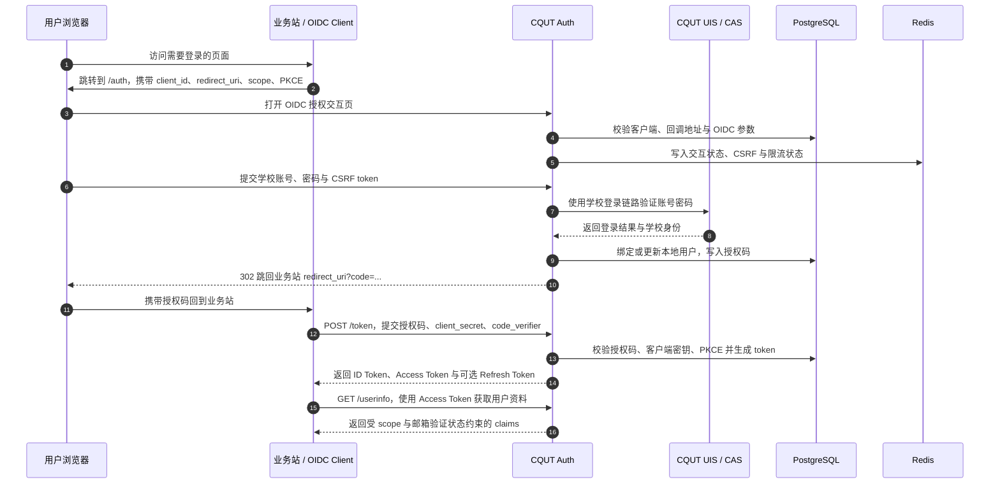

> [!NOTE]
> 本项目大部分代码、测试和文档均由智能体编写。维护者仅对体感功能进行简单测试，对数据安全与代码质量不作任何保障，但我们会尽最大努力修复问题。

<div align="center">
  <a href="LICENSE"></a>
  <a href="https://nodejs.org/"></a>
  <a href="https://pnpm.io/"></a>
</div>

## ✨ 特性 (Features)

- **🏫 无缝对接校园认证**：将学校 UIS / CAS 登录链路安全包装为标准 OIDC 登录入口。
- **🔐 标准协议支持**：完整支持 Authorization Code + PKCE 流程，签发高可靠 ID / Access Token。
- **🎛️ 受控客户端管理**：客户端由 PostgreSQL 持久化，通过登录保护的管理台创建、审核、编辑和停用。
- **🛡️ 生产级安全防护**：内置交互页 CSRF 校验、端点及登录限流、Refresh Token Rotation、Artifact 自动清理。
- **📧 邮箱验证引擎**：原生内置 Resend 邮件服务支持，保障用户的实名绑定链路。
- **📦 现代化技术栈**：搭配 PostgreSQL 持久化与 Redis 高缓存，基于 Node.js 24 无缝构建。

## 🏗️ 原理与架构 (Architecture)

CQUT Auth 不存储学校的账号密码，亦不强行替代业务站的原始用户系统。它在 OIDC 协议和学校登录链路间建立了一座信任代理桥梁：业务站发起标准登录请求，随后用户在受控沙箱向学校系统进行身份验证；验证通过后，服务将对应凭据映射为本地 Subject，向业务终端下放 Token。

整个流程由四个逻辑核心层组成：

1. **入口层**：外部 HTTPS 代理（如 Nginx）处理 TLS 连接与业务卸载。
2. **协议层**：实现核心的 OIDC 通信逻辑端点 (`/auth`, `/token`, `/userinfo`, `/jwks`, `/session/end`)。
3. **身份层**：负责下发鉴权表单，转接 CQUT UIS / CAS 的交互，并完成邮件、会话等上下文映射。
4. **存储层**：利用 PostgreSQL 沉淀稳定数据，依赖 Redis 提供高频瞬态防护能力（限流与会话隔离）。



## 🚀 快速开始 (Getting Started)

### 前置依赖 (Prerequisites)

- [Node.js](https://nodejs.org/) v24+
- [pnpm](https://pnpm.io/) v10+
- [Docker](https://www.docker.com/) 20.10+ & [Compose](https://docs.docker.com/compose/) v2+

### 一键启动

1. **获取代码并安装依赖**

   ```bash
   pnpm install
   ```

2. **本地测试环境 (HTTP)**

   ```bash
   # 初始化测试环境，自动配置内置 demo 客户端
   pnpm init-env --force --profile test

   # 启动后端中间件集群
   docker compose -f deploy/docker-compose.yml up -d --build

   # 等待启动并检测健康状态
   curl http://127.0.0.1:3003/health/ready
   curl http://127.0.0.1:3003/.well-known/openid-configuration
   ```

   _注意：使用 `--force` 将抹除先前的加密轮数并覆写预置信息。如若数据库中保留了早期密码可能会发生鉴权拒绝，推荐执行 `docker compose -f deploy/docker-compose.yml down -v` 彻底洗卷。_

3. **本地开发联调网络 (HTTPS)**
   适用于由宿主机或网关代理终止 TLS 的场景：

   ```bash
   pnpm init-env --force --profile local --issuer https://verify.local
   docker compose -f deploy/docker-compose.yml up -d --build
   ```

## 🛠️ 部署指南 (Deployment)

推荐的拓扑是由您自己控制的反向代理暴露对外 HTTPS 入口，通过 Compose 打包发布服务集群。

```bash
# 生成供正式使用的 env 安全模板
pnpm init-env --force --profile production --issuer https://auth.example.com

# 以后台常驻唤起
docker compose -f deploy/docker-compose.prod.yml up -d --build
```

**🚨 生产上线前检查清单：**

- [ ] `OIDC_ISSUER` 必须与外场可达的 HTTPS 域名完全对齐。
- [ ] `OIDC_COOKIE_SECURE=true`、`TRUST_PROXY_HOPS=1` 与 `TRUSTED_PROXY_CIDRS` 配置完毕，反向代理必须覆盖 `X-Forwarded-For`。
- [ ] 项目中涉及的各套秘钥组（Cookie / 加密 / Redis 等）均已更改为高熵值。
- [ ] `RESEND_API_KEY` 及 `OIDC_EMAIL_FROM` 已正确就绪以实现邮箱鉴权下行。
- [ ] 如需预置客户端，已写入 `deploy/oidc-clients.json`；缺失或空文件允许从零客户端启动。
- [ ] 至少一名管理员的 Subject ID 已写入 `OIDC_ADMIN_SUBJECT_IDS`。
- [ ] 初次启动可通过设定 `OIDC_AUTO_SEED_SIGNING_KEY=true` （或命令执行）完成签名私钥分发。
- [ ] 确保 `APP_ENV=production` 环境下正确连接到了非易失形态的 PostgreSQL 与 Redis 实例。

## 🔌 接入文档 (Integration)

### 基本安全要求

- 当前环境下拒绝 Implicit 以及部分混合模式，强校验 **Authorization Code + PKCE (`S256`)** 协议流。
- 正式环境下回调及回溯域必须通过 `https://` 约束，严防劫持。

### 客户端初始化与管理

数据库是客户端配置的唯一运行时数据源。`oidc-clients.json` 只在 `oidc_clients` 表为空时进行一次性、事务化导入；只要表中已有任意记录，后续启动不会读取、校验或覆盖该文件。JSON 导入的客户端没有所有者，只有管理员能够维护。

打开 `/manage`，使用校园统一身份认证账号登录即可创建和管理自己的客户端。首次部署管理员可按以下流程配置：

1. 普通登录 `/manage`，在页面顶部复制自己的 `Subject ID`；
2. 将该值加入 `OIDC_ADMIN_SUBJECT_IDS`（多个值以逗号分隔）；
3. 重启服务，再次登录后即可看到“全部客户端”和“待审核”。

API 或管理台创建的客户端统一进入 `pending`。Web 客户端的 `client_id` 与高熵 `client_secret` 由服务端生成，Secret 仅在创建响应中显示一次；SPA 是公开客户端，不生成 Secret。客户端类型创建后不可修改；已启用客户端第一轮只允许修改名称和描述，Redirect URI 或 scopes 变更请创建新客户端，避免审核期间中断生产流量。被拒绝客户端修改后进入草稿，需显式重新提交审核；停用后第一轮不能恢复。

普通主体默认最多拥有 10 个非停用客户端，其中最多 5 个处于待审核状态；管理员默认豁免配额。创建操作还按主体（默认每小时 5 次）和来源 IP（默认每小时 20 次）限流。以上值可通过 `OIDC_MANAGEMENT_CLIENT_*` 环境变量调整。

<details>
<summary><code>oidc-clients.json</code> 范例</summary>

```json
{
  "clients": [
    {
      "clientId": "demo-site",
      "displayName": "Demo Site",
      "description": "首次部署演示客户端",
      "clientSecretDigest": "scrypt$N=16384,r=8,p=1,keylen=32$<base64url-salt>$<base64url-digest>",
      "grantTypes": ["authorization_code", "refresh_token"],
      "scopeWhitelist": ["openid", "profile", "email", "student"],
      "redirectUris": ["https://demo.example.com/callback"],
      "postLogoutRedirectUris": ["https://demo.example.com/logout-complete"],
      "autoConsent": false
    }
  ]
}
```

    </details>

`offline_access` 是 Web 客户端的显式 opt-in scope，不在默认 `scopeWhitelist` 内。第一轮 SPA 固定使用 Authorization Code + PKCE，不允许 refresh token 或 `offline_access`。Native、M2M 和包含通配符或 fragment 的 Redirect URI 均不接受。

`student` scope 只增加 `status` claim。当前 `status=active` 表示该账号已通过学校 UIS/CAS 认证且可在本 OP 中使用，不代表“当前在读学生”身份；RP 不应据此推断学籍状态。

### OIDC 核心端点映射表

| 功能区        | 端点 URI                                | 操作详述                                                                                |
| :------------ | :-------------------------------------- | :-------------------------------------------------------------------------------------- |
| **Discovery** | `GET /.well-known/openid-configuration` | 获取服务支持的签名算法与节点映射表。                                                    |
| **Authorize** | `GET /auth`                             | 重定向登入，允许附带客户端白名单内的 `openid profile email student offline_access` 域。 |
| **Token**     | `POST /token`                           | basic auth/form 模式签发/转结令牌；Public Client 默认不签发 Refresh Token。             |
| **UserInfo**  | `GET /userinfo`                         | 校验 Access 以查询 User 字段。注意 `邮箱` 相关数据仅过审可返回。                        |
| **Logout**    | `GET /session/end`                      | 注销全域登录状态（应附 `id_token_hint`及回溯）。                                        |
| **JWKS**      | `GET /jwks`                             | 提供用于客户端对端强验证的 RSA-256 (RS256) 公钥串。                                     |

### 客户端管理 API

管理 API 全部位于 `/api/management`，使用独立的 HttpOnly 数据库会话；所有修改请求还必须携带管理上下文返回的 `X-CSRF-Token`。

| 路由                                                  | 说明                                                           |
| :---------------------------------------------------- | :------------------------------------------------------------- |
| `GET /auth/context`                                   | 获取登录状态、Subject ID、管理员标记和 CSRF token。            |
| `POST /auth/login` / `POST /auth/logout`              | 建立或撤销管理会话。                                           |
| `GET /clients` / `POST /clients`                      | 查询自己的客户端或创建待审核客户端；管理员可使用 `?view=all`。 |
| `GET /clients/:clientId` / `PATCH /clients/:clientId` | 查看或按 `version` 乐观锁修改客户端。                          |
| `POST /clients/:clientId/disable`                     | 永久停用客户端。                                               |
| `POST /clients/:clientId/submit`                      | 将修改后的草稿客户端重新提交审核。                             |
| `GET /admin/reviews`                                  | 管理员获取待审核列表。                                         |
| `POST /admin/reviews/:clientId/approve`               | 管理员批准待审核客户端。                                       |
| `POST /admin/reviews/:clientId/reject`                | 管理员拒绝待审核客户端，可附原因。                             |

客户端响应不会返回 Secret 摘要。创建 Web 客户端时的 `clientSecret` 只存在于该次 `201` 响应，不可再次查询。

## 🧑‍💻 常用指令 (Scripts)

```bash
# 进入调试/开发状态
pnpm dev
# 执行核心套件检查
pnpm test
pnpm lint
pnpm build

# 服务数据辅助操作
pnpm seed:key      # 为 OIDC 补种 RSA 签名池
pnpm seed:client   # 仅在客户端表为空时导入 JSON；不会覆盖已有记录
```

## 🛡️ 能力边界 (Limitations)

本项目主诉为**微型内聚的单一 Provider**，不考虑全量 OIDC 范式覆盖。

**已内置的功能：**

- Discovery、JWKS、UserInfo
- 严密安全标准的 Code + PKCE
- Refresh Token 旋转与回收
- 服务端发起的 (RP-Initiated) 会话截断

**暂无预期的功能（规划外）：**

- 动态应用注册 (Dynamic Registration) 与回收销毁验证
- 设备层授权流 (Device Auth Flow)
- 隐式流与杂凑流 (Implicit / Hybrid OIDC)
- 复杂的 Pairwise ID 等隐私隔离模型
- Native、M2M、域名验证、使用统计和复杂组织模型
- Secret 重置、双 Secret 轮换或已停用客户端恢复

## 📄 许可证 (License)

本项目基于 [MIT License](LICENSE) 通用协议授权。
